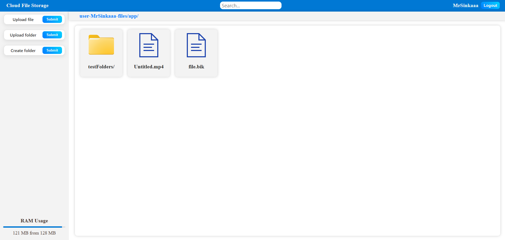

# Cloud File Storage

A simple cloud file storage web service built with Spring Boot and Thymeleaf.  
Allows users to upload, browse, download and delete files via a clean web interface.




---

## 🚀 Features

- **File Upload** through a user-friendly web form  
- **List View** of all uploaded files  
- **Download** any file with a single click  
- **Delete** unwanted files  
- Full **Dockerization** for easy deployment  

---

## 🛠 Tech Stack

- **Java 17**  
- **Spring Boot** (Web, MVC)  
- **Thymeleaf**  
- **Gradle** (or the Gradle Wrapper)  
- **Docker & Docker Compose**
- **Redis**
- **MinIO**

---

## ⚙️ Prerequisites

- **JDK 17**  
- **Gradle** (optional, you can use `./gradlew`)  
- **Docker & Docker Compose** (for containerized setup)

---

## 📥 Installation & Running

1. **Clone the repo**  
   ```bash
   git clone https://github.com/MrSinkaaa/cloud-file-storage.git
   cd cloud-file-storage
